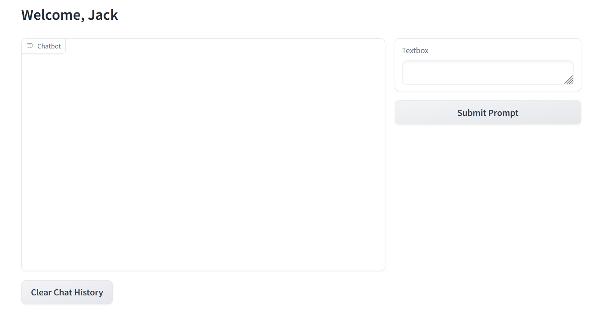

# Chat bot with user login

## Requirements
Python v 3.10.12

Libaries
- llama-cpp-python
- llama-cpp-python[server]
- gradio

Model
- download the mistral 7B model from here [mistral-7b-instruct-v0.2.Q5_K_S.gguf](https://huggingface.co/TheBloke/Mistral-7B-Instruct-v0.2-GGUF/blob/main/mistral-7b-instruct-v0.2.Q5_K_M.gguf)

## Running
### Start the Server
Run llama-cpp-python[server] with the following command

```
python3 -m llama_cpp.server --model ./models/mistral-7b-instruct-v0.2.Q5_K_S.gguf --n_ctx 16192
```

Test the server by going to http://localhost:8000/docs

### Start the user interface
```
python3 main.py
```

- Go to http://127.0.0.1:7860/ 
- login: Jack or Jill [capital J matters]
- password: password

You should see something like this:
